# DZ 01 · Local LLMs — First Model

<p align="center">
  <strong>Практическое исследование локальных LLM</strong><br>
  Parameter experiments · benchmark · evaluator audit · FATHER integration
</p>

<p align="center">
  <a href="./reports/REPORT.md"><strong>📘 Открыть полный отчёт</strong></a>
  ·
  <a href="../site/dz1.html"><strong>🖥 Course Portal</strong></a>
  ·
  <a href="./data/evaluated_results.csv"><strong>📊 Evaluated CSV</strong></a>
</p>

<p align="center">
  
  
  
  
</p>


## Результат в двух строках

**36 валидных прогонов** сохранены в CSV и разобраны в отчёте. Наиболее очевидный эффект текущего эксперимента — `max_new_tokens=64` обрезает ответы; `128` достаточно для текущих промптов, а `512` не увеличивает фактическую длину.

Дополнительно найдены две инженерные проблемы: **DeepSeek integration pipeline** выдаёт повреждённые ответы и **`trap_logic_auto` даёт ложноположительную оценку 9/9 для Qwen**, поэтому evaluator требует отдельного тестирования.

## Задание

Исследовать влияние:

- `temperature`: 0.1 / 0.7 / 1.2;
- `top_p`: 0.1 / 0.8 / 0.99;
- `max_new_tokens`: 64 / 128 / 512.

Два одинаковых вопроса используются для всех конфигураций:

1. короткий рассказ на 3–4 предложения;
2. логическая задача-ловушка про свечи.

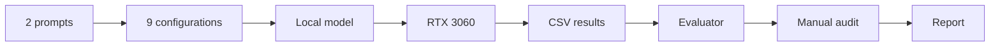

## Фактический benchmark

| Модель | Валидных прогонов | Avg tok/s | Avg latency | Статус |
|---|---:|---:|---:|---|
| Qwen1.5-7B | 18 | 8.31 | 10.36 s | usable baseline |
| DeepSeek-7B | 18 | 11.17 | 2.14 s | pipeline issue |
| Mistral-7B | 0 | — | — | weights load error |

> DeepSeek нельзя считать «лучше» по скорости: его ответы содержат признаки ошибки chat-template/tokenization pipeline. Полный разбор — в [REPORT.md](./reports/REPORT.md).

## Ключевые графики

### Max token limit

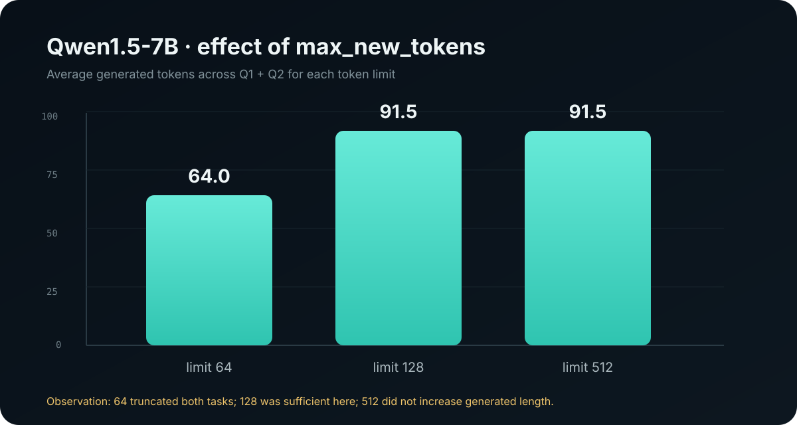

### Instruction adherence

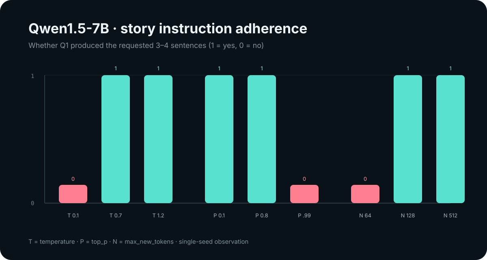

### Raw runtime comparison

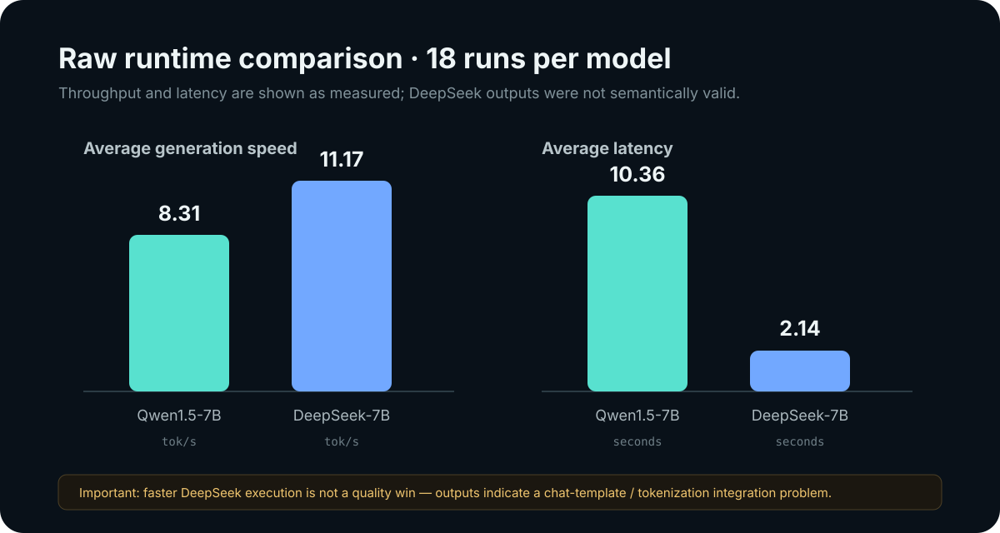

### Evaluator audit

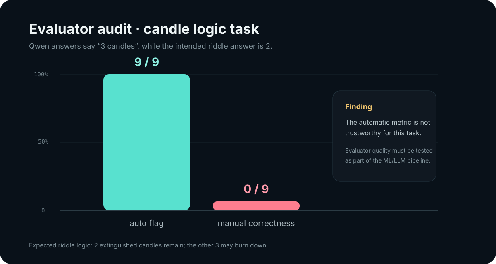

## Самая важная инженерная находка

```text
MODEL QUALITY
     │
     ├── sampling params
     ├── chat template
     ├── tokenizer
     ├── runtime
     ├── prompt
     └── evaluator
              │
              └── тоже может ошибаться
```

В задаче про свечи автоматический evaluator поставил Qwen **9/9 success**, хотя текстовый ответ модели — «3 свечи», а ожидаемая логика задачи — 2. Это означает, что оценочная система должна проходить собственные unit/golden tests.

## Визуальная часть

<table>
<tr>
<td width="50%">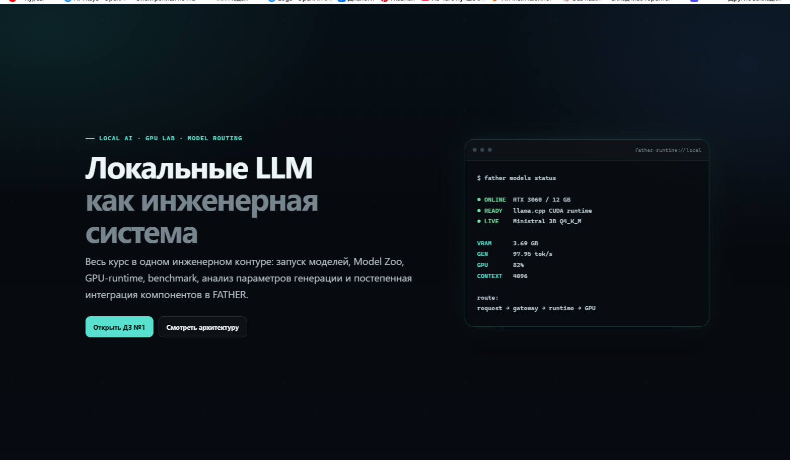<br><b>01 · Course overview</b></td>
<td width="50%">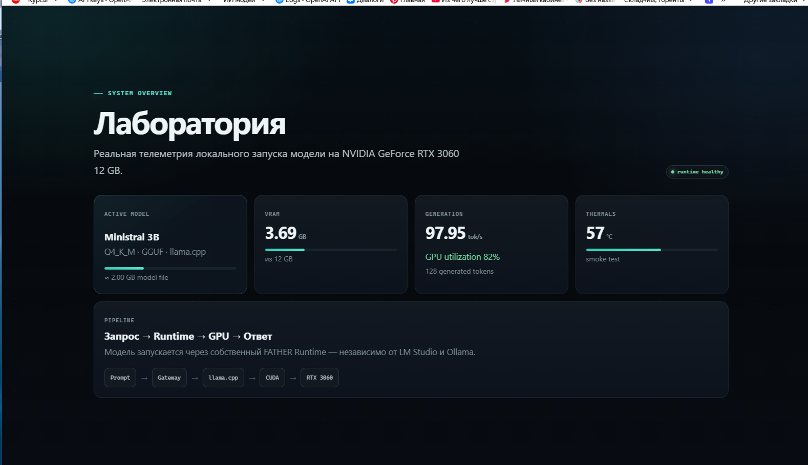<br><b>02 · Runtime Lab</b></td>
</tr>
<tr>
<td>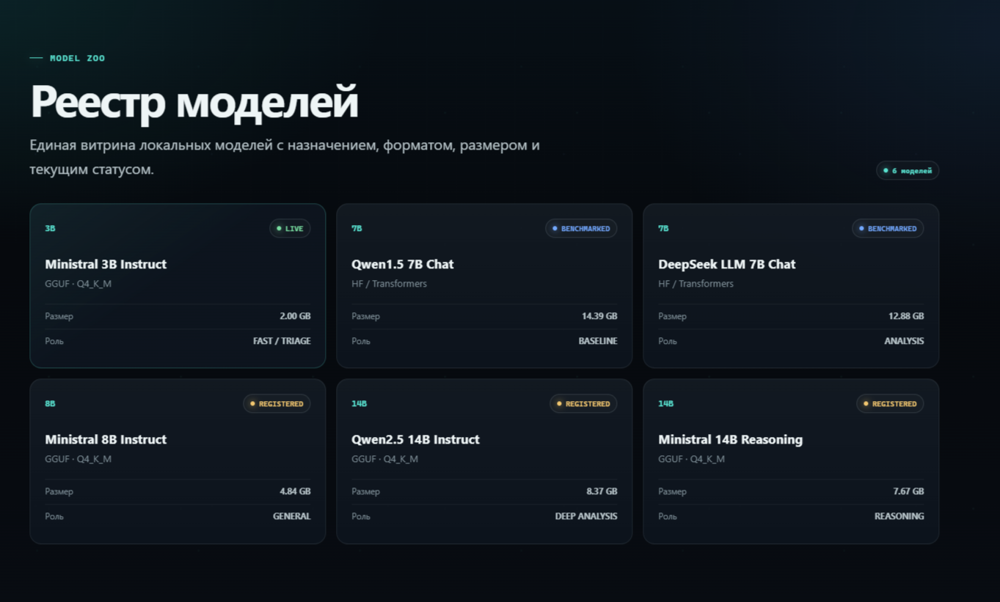<br><b>03 · Model Zoo</b></td>
<td>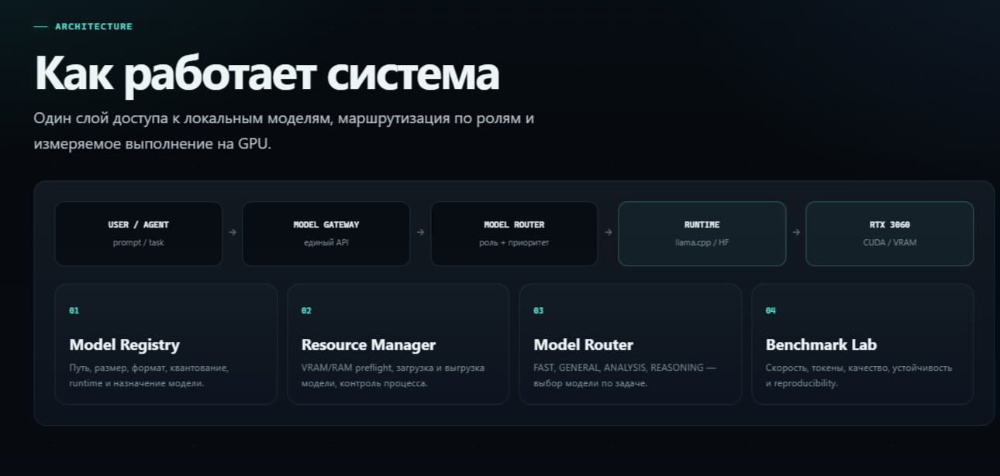<br><b>04 · Architecture</b></td>
</tr>
<tr>
<td>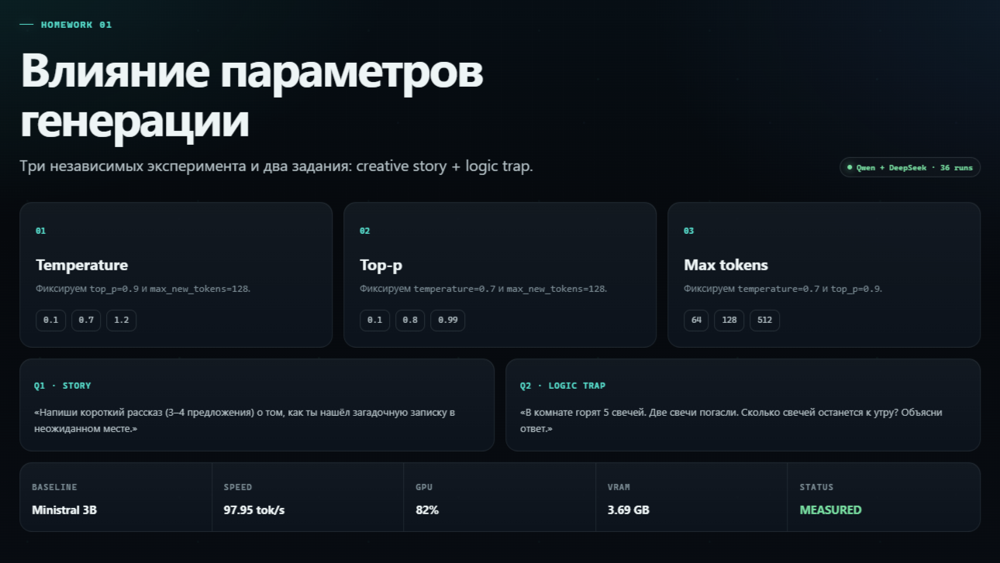<br><b>05 · Method</b></td>
<td><br><b>06 · Results</b></td>
</tr>
<tr>
<td>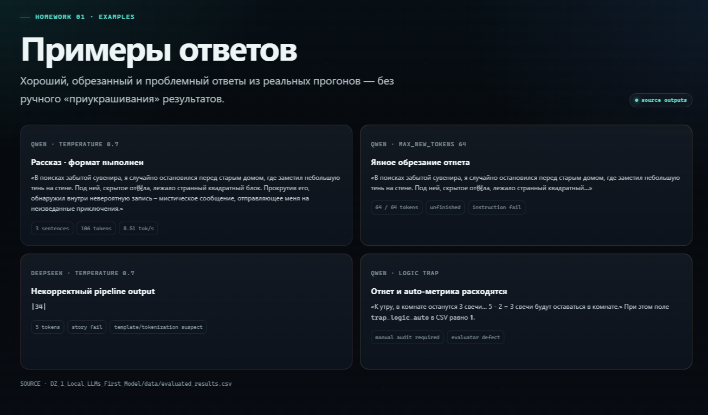<br><b>07 · Examples</b></td>
<td>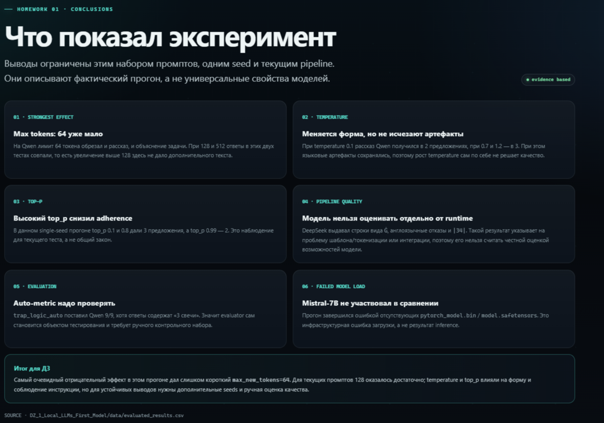<br><b>08 · Conclusions</b></td>
</tr>
</table>

## Структура

```text
DZ_1_Local_LLMs_First_Model/
├── README.md
├── config.json
├── src/
│   ├── benchmark.py
│   └── evaluator.py
├── dashboard/
├── notebooks/
├── data/
│   ├── raw_results.csv
│   └── evaluated_results.csv
├── reports/
│   ├── REPORT.md
│   └── assets/
│       ├── 01_qwen_tokens_limit.svg
│       ├── 02_qwen_story_adherence.svg
│       ├── 03_model_runtime_comparison.svg
│       └── 04_evaluator_audit.svg
└── screenshots/
    ├── 01_overview.png
    ├── 02_runtime_lab.png
    ├── 03_model_zoo.png
    ├── 04_architecture.png
    ├── 05_dz1_method.png
    ├── 06_dz1_results.png
    ├── 07_dz1_examples.png
    └── 08_dz1_conclusions.png
```

## Запуск

```powershell
cd "G:\1\Local LLMs\DZ_1_Local_LLMs_First_Model"

.\.venv\Scripts\Activate.ps1
.\RUN_BENCHMARK.ps1
.\RUN_DASHBOARD.ps1
```

## Ограничения

Результаты относятся к конкретному эксперименту: один seed (`42`), два промпта и текущая версия pipeline. Для более устойчивых выводов следующий цикл должен включать несколько seeds, golden-cases evaluator и повтор DeepSeek после исправления интеграции.

## Полный отчёт

➡️ **[DZ 01 — полный инженерный отчёт](./reports/REPORT.md)**

---

**Engineering, not just prompting.**  
Эта работа сохраняется как часть FATHER Model Lab, а не как одноразовое учебное задание.
