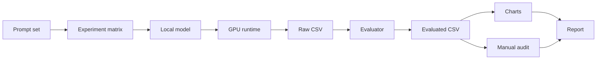
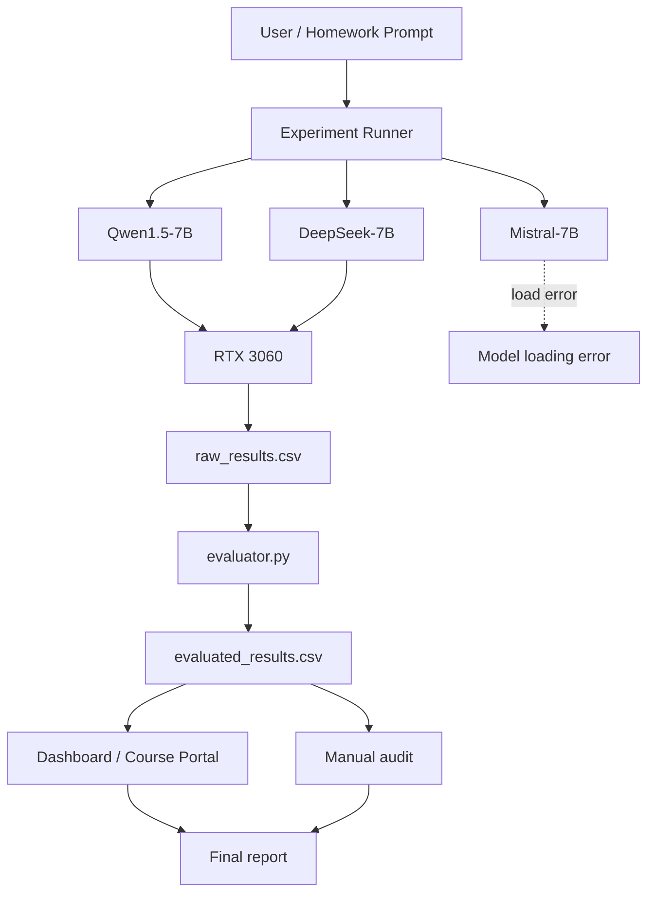
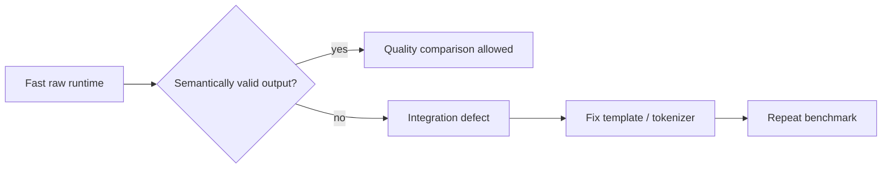

# DZ 01 — Исследование локальных LLM и параметров генерации

  <strong>Local LLMs · FATHER Model Lab</strong> 
  Локальный inference · benchmark · evaluator audit · визуальный отчёт

  
  
  
  

> **Главный вывод:** в текущем single-seed эксперименте самым очевидным негативным фактором оказался слишком короткий `max_new_tokens=64`: он обрезал ответы Qwen на обоих заданиях. При `128` и `512` длина фактически перестала расти. Одновременно эксперимент выявил две инженерные проблемы — некорректный pipeline DeepSeek и ошибочную автоматическую метрику `trap_logic_auto`.

---

## 1. Цель

Исследовать влияние параметров генерации локальной LLM на:

- креативность и вариативность;
- связность и завершённость;
- следование инструкции;
- логическую устойчивость;
- скорость генерации и latency;
- поведение при экстремальных значениях параметров.

Работа расширена сверх минимального задания до инженерного контура: **benchmark → CSV → evaluator → визуализация → отчёт → FATHER Model Lab**.

---

## 2. Экспериментальный контур

### Hardware

| Компонент | Значение |
|---|---|
| GPU | NVIDIA GeForce RTX 3060 12 GB |
| RAM | ~32 GB |
| OS | Windows |
| Стратегия | одна модель за раз |
| Основной стек | Python, Transformers, CUDA, GGUF/llama.cpp |
| Seed | 42 |

Отдельный smoke-test FATHER Runtime для Ministral 3B показал **97.95 tok/s**, 3.69 GB VRAM, 82% GPU load и 57 °C. Этот показатель относится к runtime baseline и не смешивается с HF benchmark Qwen/DeepSeek.

---

## 3. Тестовые задания

### Q1 · Story

> Напиши короткий рассказ (3–4 предложения) о том, как ты нашел загадочную записку в неожиданном месте.

Проверяется способность выполнить формат, сохранить связность и не оборвать ответ.

### Q2 · Logic trap

> В комнате горят 5 свечей. Две свечи погасли. Сколько свечей останется к утру? Объясни ответ.

Ожидаемый смысл задачи-ловушки: **две погасшие свечи останутся, три горящие могут сгореть**.

---

## 4. Матрица параметров

| Эксперимент | Изменяемый параметр | Значения | Фиксированные параметры |
|---|---|---|---|
| Temperature | `temperature` | 0.1 / 0.7 / 1.2 | `top_p=0.9`, `max_new_tokens=128` |
| Top-p | `top_p` | 0.1 / 0.8 / 0.99 | `temperature=0.7`, `max_new_tokens=128` |
| Length | `max_new_tokens` | 64 / 128 / 512 | `temperature=0.7`, `top_p=0.9` |

На одну модель: **9 конфигураций × 2 вопроса = 18 прогонов**.

Фактический набор:

- Qwen1.5-7B — 18 валидных прогонов;
- DeepSeek-7B — 18 валидных технических прогонов;
- Mistral-7B — отдельная ошибка загрузки весов;
- всего в CSV — 37 строк, из них **36 валидных inference rows**.

---

## 5. Архитектура стенда

---

## 6. Результаты Qwen1.5-7B

### 6.1 Влияние max_new_tokens

| Limit | Avg generated tokens | Наблюдение |
|---:|---:|---|
| 64 | 64.0 | оба ответа упираются в лимит |
| 128 | 91.5 | ответы завершаются |
| 512 | 91.5 | дополнительной длины не появилось |

Это наиболее чистый эффект всего эксперимента. На `64` ответ Q1 заканчивается посреди фразы, а объяснение Q2 — на выражении `5 - 2 =`.

**Практический вывод:** увеличение лимита с 64 до 128 было полезным; увеличение 128 → 512 для этих двух промптов уже не дало пользы.

### 6.2 Следование формату 3–4 предложения

Qwen выполнил автоматический критерий «3–4 предложения» в **6 из 9** Q1-прогонов.

Наблюдения текущего seed:

- `temperature=0.1` → 2 предложения;
- `temperature=0.7` → 3 предложения;
- `temperature=1.2` → 3 предложения;
- `top_p=0.1` → 3 предложения;
- `top_p=0.8` → 3 предложения;
- `top_p=0.99` → 2 предложения;
- `max_new_tokens=64` → ответ оборван;
- `128` и `512` → 3 предложения.

Это **наблюдение данного прогона**, а не универсальная зависимость. Для статистического вывода нужны дополнительные seeds.

### 6.3 Производительность

По 18 Qwen-прогонам:

| Метрика | Значение |
|---|---:|
| Avg latency | 10.36 s |
| Avg generation speed | 8.31 tok/s |
| Avg generated tokens | 85.89 |
| Q1 format success | 6 / 9 |

---

## 7. Cross-model comparison

| Модель | Runs | Avg tok/s | Avg latency | Q1 3–4 sentences |
|---|---:|---:|---:|---:|
| Qwen1.5-7B | 18 | 8.31 | 10.36 s | 6 / 9 |
| DeepSeek-7B | 18 | 11.17 | 2.14 s | 0 / 9 |

На голых runtime-метриках DeepSeek выглядит быстрее. Но его содержательные результаты были повреждены: встречались англоязычные отказы, символы `Ġ` и ответы вида `|34|`.

Поэтому **скорость DeepSeek нельзя интерпретировать как превосходство модели**. Такой результат скорее указывает на проблему chat template / tokenizer / decoding / integration pipeline.

---

## 8. Аудит evaluator

Самая важная находка работы — автоматический evaluator тоже может ошибаться.

В CSV поле `trap_logic_auto` для Qwen равно **1 в 9/9 прогонах**, хотя сами ответы утверждают, что к утру останется **3 свечи**.

Для принятой логики задачи правильный смысл — **2 свечи**.

Следовательно:

| Проверка | Результат |
|---|---:|
| Auto flag | 9 / 9 success |
| Manual semantic correctness | 0 / 9 |
| Вывод | auto-evaluator ненадёжен для этого критерия |

Это превращает ДЗ из простого «покрутить temperature» в полноценный урок по LLM evaluation: **метрика сама должна иметь тесты и контрольные примеры**.

---

## 9. Негативные эффекты экстремальных параметров

### Temperature

При `0.1` рассказ получился короче заданного. При `0.7` и `1.2` формат был соблюдён, однако языковые артефакты не исчезли. Повышение temperature не является автоматическим улучшением качества.

### Top-p

В текущем seed `0.1` и `0.8` дали 3 предложения, `0.99` — 2. Этого недостаточно, чтобы делать универсальный вывод о top-p, но достаточно, чтобы показать чувствительность генерации к sampling-параметрам.

### Max new tokens

`64` дал наиболее воспроизводимый негативный эффект: явное обрезание вывода. `128` оказалось достаточно для данных промптов, а `512` не принесло дополнительной пользы.

---

## 10. Пример реального ответа

### Qwen · temperature 0.7 · Q1

> В поисках забытой сувенира, я случайно остановился перед старым домом, где заметил небольшую тень на стене. Под ней, скрытое от視ла, лежало странный квадратный блок. Прокрутив его, обнаружил внутри невероятную запись – мистическое сообщение, отправляющее меня на неизведанные приключения.

Формат 3 предложений выполнен, но видны грамматические и Unicode-артефакты.

### Qwen · max_new_tokens 64 · Q1

> В поисках забытой сувенира, я случайно остановился перед старым домом, где заметил небольшую тень на стене. Под ней, скрытое от視ла, лежало странный квадратный

Это наглядный пример truncation.

### DeepSeek · temperature 0.7 · Q1

> `|34|`

Такой вывод нельзя использовать для содержательного сравнения моделей.

---

## 11. Визуальный отчёт

### 01 · Обзор

### 02 · Runtime Lab

### 03 · Model Zoo

### 04 · Архитектура

### 05 · Методика

### 06 · Результаты

### 07 · Примеры

### 08 · Выводы

---

## 12. Что именно показал эксперимент

1. **Max token limit дал наиболее очевидный эффект.** При 64 ответ физически не помещался; 128 было достаточно для текущих промптов.
2. **Sampling влияет на форму ответа.** Temperature и top-p меняли количество предложений и формулировки, но один seed недостаточен для статистического закона.
3. **Runtime-метрики нельзя отделять от качества результата.** DeepSeek был быстрее, но pipeline выдавал некорректный текст.
4. **Evaluator — часть системы, которую тоже нужно тестировать.** Автоматическая логическая метрика дала ложноположительные 9/9.
5. **Ошибка загрузки модели — отдельный класс результата.** Mistral-7B не должен попадать в сравнение inference-качества, пока не исправлена поставка весов.

---

## 13. Ограничения исследования

Чтобы выводы были корректными, фиксируются ограничения:

- один seed: `42`;
- только два промпта;
- ручные оценки creativity/coherence пока не заполнены;
- DeepSeek pipeline требует исправления и повторного прогона;
- Mistral-7B не загрузился;
- параметры сравнивались изолированно, без многомерного grid search.

Поэтому отчёт делает **локальные инженерные выводы по фактическому прогону**, а не заявляет универсальное ранжирование моделей.

---

## 14. Следующий цикл улучшения

План следующего benchmark:

- 3–5 seeds на конфигурацию;
- golden cases для evaluator;
- отдельные метрики instruction following / logic / language quality;
- повторный DeepSeek benchmark после исправления pipeline;
- GGUF-модели из FATHER Model Zoo;
- latency, VRAM, tok/s и quality в одной трассируемой записи.

---

## 15. Артефакты

| Артефакт | Путь |
|---|---|
| Raw results | `data/raw_results.csv` |
| Evaluated results | `data/evaluated_results.csv` |
| Benchmark runner | `src/benchmark.py` |
| Evaluator | `src/evaluator.py` |
| Dashboard | `dashboard/app.py` |
| Screenshots | `screenshots/` |
| Charts | `reports/assets/` |
| Course Portal | `../site/` |

---

## Итог

Работа показала не только влияние генерационных параметров, но и важный инженерный принцип локальных LLM-систем:

> **качество конечного ответа определяется не одной моделью, а всей цепочкой — prompt → sampling → template → tokenizer → runtime → evaluator → human audit.**

Именно поэтому результаты ДЗ сохраняются не как одноразовый notebook, а как часть **FATHER Model Lab** — будущего контура выбора и маршрутизации локальных моделей по измеримым характеристикам.
