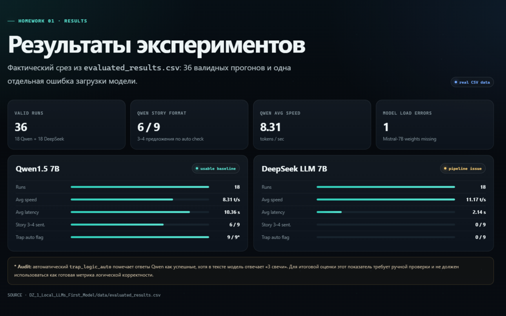
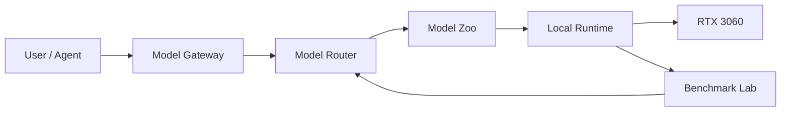

# Local LLMs · FATHER Model Lab

> Практический курс по локальным LLM, который развивается как инженерная лаборатория: запуск моделей, benchmark, Model Zoo, маршрутизация, RAG и интеграция с FATHER.

[](#)
[](#)
[](#)
[](#)

## Быстрые ссылки

- **Course Portal:** https://victorkvs.github.io/Local-LLMs/
- [Frontend Standard](./docs/FRONTEND_STANDARD.md)
- [Course Structure](./docs/COURSE_STRUCTURE.md)
- [Screenshot Guide](./docs/SCREENSHOT_GUIDE.md)
- [Site README](./site/README.md)

## О проекте

Этот репозиторий хранит весь учебный трек **Local LLMs** и одновременно служит публичной инженерной витриной.

Каждая лабораторная работа оформляется не как одноразовое ДЗ, а как повторно используемый компонент будущей платформы **FATHER**:

- локальные модели и Model Zoo;
- runtime и управление GPU/VRAM;
- воспроизводимые benchmark-эксперименты;
- prompt / generation parameter analysis;
- RAG, embeddings и reranking;
- model routing;
- мультимодальные и content pipelines;
- интеграция с агентами и внешними API.

## Текущее состояние

| Компонент | Статус |
|---|---|
| FATHER Local Model Runtime | ✅ работает |
| RTX 3060 12 GB / CUDA | ✅ работает |
| Ministral 3B GGUF | ✅ smoke test |
| Qwen1.5 7B | ✅ benchmark |
| DeepSeek LLM 7B | ✅ benchmark |
| Ministral 8B | 🟡 зарегистрирован |
| Qwen2.5 14B | 🟡 зарегистрирован |
| Ministral 14B Reasoning | 🟡 зарегистрирован |
| Course Portal / GitHub Pages | 🚧 подключается |

### Измеренный baseline

```text
Model:       Ministral 3B Instruct Q4_K_M
GPU:         NVIDIA GeForce RTX 3060 12 GB
Runtime:     llama.cpp / CUDA
Context:     4096
VRAM:        3.69 GB
GPU load:    82%
Temperature: 57 °C
Generation:  97.95 tok/s
```

## Структура курса

```text
Local-LLMs/
├── DZ_1_Local_LLMs_First_Model/
├── lessons/
├── homeworks/
├── experiments/
├── benchmarks/
├── notebooks/
├── models/
├── model_inventory/
├── projects/
├── scripts/
├── docs/
└── site/                 # публичный Course Portal
```

## Домашние работы

### DZ 01 · Первая локальная LLM

[](./DZ_1_Local_LLMs_First_Model/reports/REPORT.md)
[](./DZ_1_Local_LLMs_First_Model/data/evaluated_results.csv)



**[README ДЗ](./DZ_1_Local_LLMs_First_Model/README.md) · [Полный отчёт](./DZ_1_Local_LLMs_First_Model/reports/REPORT.md) · [CSV](./DZ_1_Local_LLMs_First_Model/data/evaluated_results.csv)**


Цель: исследовать влияние параметров генерации на стиль, связность и полноту ответа.

Эксперименты:

1. **Temperature** — 0.1 / 0.7 / 1.2
2. **Top-p** — 0.1 / 0.8 / 0.99
3. **Max new tokens** — 64 / 128 / 512

Тестовые задания:

- короткий рассказ на 3–4 предложения;
- логическая задача-ловушка про свечи.

### DZ 02 · AI Content Maker Lite

План: единый сценарий → рассылка → подкаст → video-avatar pipeline, интеграция с внешним API.

## Архитектурная идея



Главный принцип: **выбор модели должен опираться на измерения**, а не только на её размер или репутацию.

## Course Portal

Публичный сайт курса — отдельный frontend-полигон для роли **Makar / Frontend & Visual Systems**.

Ключевые требования:

- строгая современная типографика;
- 8-point spacing system;
- ограничение длины строки;
- адаптивная сетка;
- читаемость на 1366–1920 px;
- отдельный screenshot mode для отчётов;
- тёмный **Strict Magic / Engineering Noir** visual language;
- визуализации benchmark, runtime и Model Zoo;
- WCAG-friendly contrast;
- минимальная зависимость от внешних библиотек.

Локальный preview:

```powershell
cd "G:\1\Local LLMs"
python -m http.server 8080 --directory site
```

Screenshot mode:

```text
http://127.0.0.1:8080/dz1.html?shot=1
```

## Принципы репозитория

- модели и веса **не коммитятся**;
- секреты и API keys **не коммитятся**;
- результаты benchmark сохраняются отдельно от исходного кода;
- каждый эксперимент должен быть воспроизводимым;
- README фиксирует цель, методику, результат и выводы;
- графики и скриншоты являются частью отчётности;
- учебные компоненты проектируются с возможностью дальнейшего включения в FATHER.

## Hardware

- NVIDIA GeForce RTX 3060 12 GB
- Python 3.10/3.12
- CUDA
- llama.cpp
- Transformers / bitsandbytes
- GGUF + Hugging Face models

## Roadmap

```text
01  First Local LLM              ✅
02  AI Content Maker Lite        ▶ next
03  Embeddings / RAG             ◻
04  Evaluation & Benchmarks      ◻
05  Model Routing                ◻
06  Agent / Tool Integration     ◻
07  FATHER Model Gateway         ◻
```

---

**Engineering, not just prompting.**

Учебные работы здесь становятся частью общей инженерной системы, а не исчезают после сдачи.
